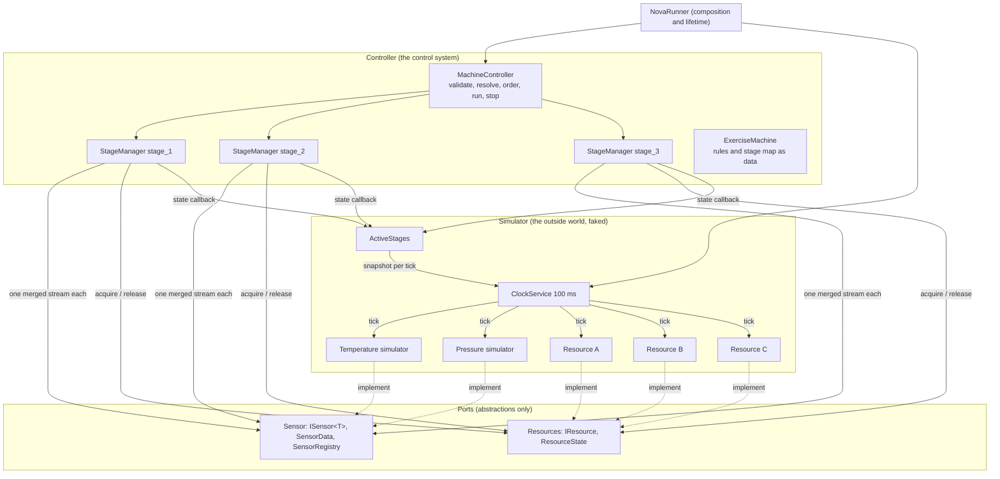
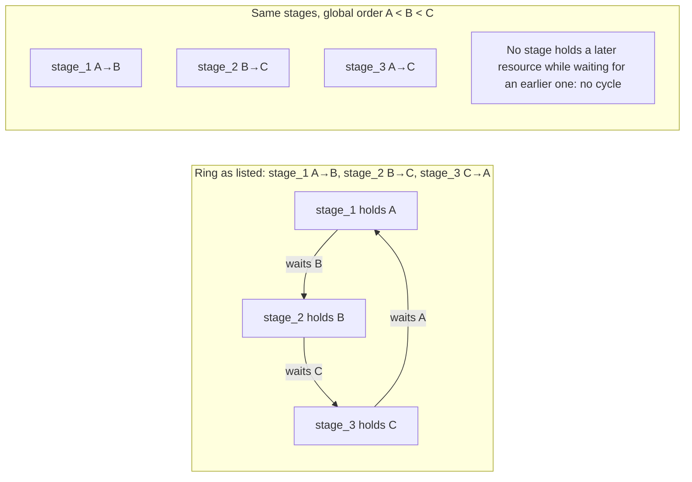

# Design

This document is Part 1 of the exercise: the conceptual design, the decisions behind it, and the concurrency
analysis. It describes the code as it is; where an earlier assumption changed during implementation, the change
and the reason are recorded in the assumptions section.

## 1. The problem in one paragraph

A machine has sensors that publish every 100 ms, three processing stages, and three exclusive resources. Each
stage runs when a rule over the sensor values holds and needs two of the three resources for its whole run. Every
pair of stages shares a resource, so at most one stage can ever be doing work at a time; the concurrency is in the
contention, not in simultaneous execution. Sensors may be added or replaced. Resources can fail. The exercise asks
for a design that handles at least one deadlock and two non-deadlock concurrency problems, and can be explained.

## 2. Architecture

### Components



| Component | Responsibility | Does not |
| --- | --- | --- |
| `ISensor<T>` / `SensorData` | A sensor's identity, its latest reading (a register), and a stream of readings (an interrupt line). A reading carries a per-sensor sequence number. | Know who consumes it. |
| `SensorRegistry` | Registration before start-up; one merged stream per consumer; fails the stream when any sensor's stream ends or throws. | Replace sensors live. |
| `IResource` | Exclusive ownership with Idle, Busy and Error; non-blocking and blocking acquisition; release. | Know who holds it. |
| `StageManager` | One stage as an independent process: assembles frames from readings, evaluates its rule, acquires its resources in the given order, does its work, releases, and aborts when a resource fails or the rule stops holding. Owns its whole lifecycle under one lock. | Coordinate with other stages except through resources. |
| `MachineController` | Validates the configuration, resolves resource names, applies the global resource ordering, starts every stage on its own task, forwards stage state changes, stops everything. | Make control decisions. |
| `ExerciseMachine` | The exercise's three rules, three resources and stage map as data, plus the ring-ordered variant for the deadlock demo. | Contain behaviour. |
| `ClockService` | The single source of simulated time: one timestamp and one snapshot of the active stages per tick, handed to every simulated device. | Exist in a real deployment. |
| Sensor and resource simulators | Physics that reacts to which stages are running; resources that fail at random and recover; a device handshake latency; a mute switch. | Leak into the controller. |
| `NovaRunner` | Wires the two sides together and owns Ctrl+C. The stage-name to `Stage` enum map is the only glue. | Contain logic. |

The dependency direction is the design's main property: `Controller` references only the two port projects.
`Simulator` references `Controller` so the fake environment can react to the machine, never the other way round.
A real deployment replaces the `Simulator` project with device adapters and keeps `Controller` untouched.

### Communication patterns

- **Sensor to stage: publish and subscribe with latest-value buffers.** Each consumer of a sensor gets its own
  one-slot, drop-oldest channel. The producer's publish never blocks and runs no consumer code, so a slow
  consumer neither stalls the sensor nor the other consumers. The registry merges a consumer's sensor channels into
  one stream; each stage opens its own.
- **Stage to resource: direct calls on a shared object.** Acquisition parks on an async semaphore; release
  wakes the next waiter. No central scheduler.
- **Stage to environment: a callback.** The controller forwards stage state changes; the host maps them onto
  the simulator's `ActiveStages`, an immutable set swapped atomically so a tick never sees a half-update.
- **Clock to devices: a synchronous fan-out with a barrier.** Every tickable gets the same timestamp and stage
  snapshot; tick N finishes before tick N+1 starts.
- **Everything else: logging.** Every component takes an `ILogger`; Information tells the story, Debug explains
  decisions, Trace shows every tick and reading.

### Sequence: one tick to one run

```mermaid
sequenceDiagram
    participant Clock
    participant T as Temperature
    participant P as Pressure
    participant Reg as SensorRegistry stream
    participant S as StageManager
    participant RA as Resource A
    participant RB as Resource B
    Clock->>T: Tick(t, active)
    T-->>Reg: reading #n (seq)
    Clock->>P: Tick(t, active)
    P-->>Reg: reading #n (seq)
    Reg-->>S: temperature #n
    Note over S: frame incomplete: pressure not yet reported
    Reg-->>S: pressure #n
    Note over S: frame complete, skew ok: evaluate rule
    S->>S: Idle -> Acquiring (published)
    S->>RA: AcquireAsync
    RA-->>S: held
    S->>RB: AcquireAsync
    RB-->>S: held
    S->>S: re-check held resources; Acquiring -> Running
    S->>S: work(ct)
    S->>RB: Release
    S->>RA: Release
    S->>S: Running -> Idle
```

### State machines

```mermaid
stateDiagram-v2
    [*] --> Idle
    Idle --> Acquiring: complete frame, rule holds,<br/>no resource in Error
    Faulted --> Acquiring: complete frame, rule holds,<br/>no resource in Error
    Acquiring --> Running: all resources held<br/>and healthy
    Acquiring --> Idle: rule no longer holds<br/>(frame) or shutdown
    Acquiring --> Faulted: a resource in Error<br/>(scan or refusal)
    Running --> Idle: work done, or rule no<br/>longer holds, or shutdown
    Running --> Faulted: a held resource<br/>enters Error
    note right of Running: Data alarm is orthogonal:<br/>raised when no frame for DataBudget,<br/>cleared by the next frame.<br/>Work continues; nothing new starts.
```



```mermaid
stateDiagram-v2
    [*] --> Idle
    Idle --> Busy: acquire
    Busy --> Idle: release
    Idle --> Error: fault
    Busy --> Error: fault (holder keeps the slot)
    Error --> Idle: recovery, not held
    Error --> Busy: recovery, still held
    note right of Error: acquire fails immediately;<br/>a waiter is refused when it wakes
```

## 3. Design considerations

### Extensibility

- **A new sensor** is one `Register` call. Stages that do not read its type are unaffected; rules read by
  `SensorType`, so a replacement of the same type changes nothing. A new type means a new enum member.
- **A new stage** is one `StageDefinition`: name, resource names, rule, work. The controller validates it.
- **A new resource** is one `IResource` in the list; the global ordering picks it up by name.
- **A real deployment** swaps the Simulator project for adapters implementing the two ports. The stage's work
  delegate is where actuator commands would go.
- **Policies are options.** Skew, staleness, data budget and watchdog period are `StageOptions`; the locking
  protocol is one enum on the controller.

### Maintainability

- Four small projects with a one-way dependency, one type per file, and the exercise's numbers kept in one
  data class rather than spread through code.
- The stage's lifecycle protocol is explicit and in one place: every transition goes through one lock, runs have
  ids, and stale transitions are ignored. That is the part the code review found implicit and is now the part the
  class comment describes first.
- No frameworks beyond logging abstractions and xUnit. Nothing to configure, nothing to upgrade.

### Testability

- Time is injectable everywhere it matters: the clock and the stage take a `TimeProvider`; the stage exposes
  `OnReading` and `Scan` so tests feed readings and advance a manual clock without streams or timers.
- Physics is a pure function on the sensor simulator; the rules are pure functions on a dictionary.
- Test doubles in the suite: a journaling resource that can block or refuse, a per-stage acquisition gate that
  forces the deadlock schedule deterministically, a manual time provider, and a harness with two sensors.
- 133 tests run in about half a second and pass with `DOTNET_PROCESSOR_COUNT=1`.

### Reliability

- **Fail fast on configuration**: unknown, duplicated or empty resource lists, duplicate stage names, rules that
  read an unregistered sensor type, registration after start-up, a second start of anything.
- **Every abnormal path releases**: cancellation, refusal, fault, work that throws, a release that throws.
- **Faults are detected on two clocks**: every reading and a watchdog timer, so a silent sensor cannot hide a
  broken resource.
- **A stage's own bugs stay in the stage**: work that throws returns the stage to Idle; a rule that throws raises
  the stage's alarm at once and the host is told. The other stages keep running.
- **Shutdown is one token**: the clock, the controller, every stage and every run stop in order and every
  resource ends Idle.

## 4. Assumptions and policies

These are the decisions the assignment leaves open. Some were sent to the recruiter as questions with defaults
before implementation; where the implemented policy differs from the default stated then, the reason is given.

| Topic | Policy | Note |
| --- | --- | --- |
| Rules | Triggers, evaluated on every complete frame while the stage is idle. A stage runs while its rule holds and re-fires after completing if it still holds. | Continuous eligibility; a queue of threshold events would be an alternative. |
| Overlapping rules | A stage runs when any rule that names it holds. | Stated as "union of stages" in the email; implemented as one condition per stage, which needs no priority and no central evaluation. |
| Frames | A rule sees a frame: every registered sensor has reported since the last frame, readings within `MaxReadingSkew` (250 ms). | Replaces the earlier "skew window" idea, which let one sensor's new value pair with another's old one. |
| Sequence numbers | Per-sensor, monotonic; older or duplicate readings are dropped; 0 means never measured. | A replacement sensor is a new registration with a new id. |
| Resources | Exclusive. Acquired one after another in the controller's global name order; a stage holds everything for its whole run. | The email said "deferred stages retried in listed order"; implemented as first-come waiting on each resource with a global order, which is simpler and provably deadlock-free. |
| Rule stops holding mid-run | The run is aborted, whether acquiring or running, and resources released. | Chosen over run-to-completion: the physics of a stage can drive its own rule false, and continuing would be acting against the evidence. |
| Resource fails while held | The run is aborted into Faulted; the stage will not start again while any of its resources is in Error. A resource recovers on its own after a simulated period. | A resource in Error cannot do the work; more commands do not help. |
| Sensor goes silent | Work in progress continues. Warning after `StaleAfter` (0.5 s), data alarm after `DataBudget` (5 s), nothing new starts without a fresh frame, a frame clears the alarm. A stream that ends or throws alarms at once. | Sensors and resources fail differently: a missing reading is absence of evidence. The stage cannot know which direction is safe (stopping the cooling stage because the thermometer died is wrong), so it does not decide; it alerts. The budget length depends on the process. |
| Deployment | One process on the machine, in-memory, no infrastructure. | A broker or database would move the concurrency problems out of the code. |
| Independent consumers | Each stage is a consumer with its own stream and buffer, in one process. | "Processes" read as independent workers, not OS processes. |

## 5. Concurrency analysis

The accompanying material is chapter 32 of *Operating Systems: Three Easy Pieces*; its vocabulary is used here.

### Deadlock

All four conditions are present in principle: resources are exclusive (mutual exclusion); a stage holds its
first resource while waiting for its second (hold and wait); cancellation asks a holder to unwind but nothing
takes a resource away (no preemption); and three stages that each need two of three resources can form a cycle
(circular wait). The design breaks circular wait with a total order: every stage acquires in resource-name order,
whatever its definition lists. In a wait cycle each stage would have to be waiting for a resource greater than
one it holds, ending at a resource smaller than where it started, which a total order forbids.



Two things worth saying out loud. The exercise's map as listed (A→B, C→B, A→C) is already consistent with the
order A < C < B, so listed-order acquisition cannot deadlock on it; it is safe by luck, and one reordering of one
stage recreates the ring. And a deadlock between async semaphores blocks no thread: three stages sit in
`Acquiring` forever with the process idle, which is why the exhibit asserts on states and resource ownership.

The assumptions behind the proof: each resource is acquired at most once per run (the controller rejects
duplicates), names are stable identities, and every acquisition in the system follows the protocol, including
any a stage's work might do. Global ordering prevents deadlock; it does not give fairness, a completion deadline,
or fault detection, which are handled separately or documented as limits.

### Atomicity violation

The chapter's example checks a value and then uses it after another thread changed it. The equivalent here is a
rule evaluated on temperature from one moment and pressure from another, a state the machine was never in. The
frame policy makes that impossible: a rule only ever sees a set of readings in which every sensor reported after
the previous evaluation. Two more places use the same idea in miniature: the resource's check-and-take is one
step under its lock, and the active-stage set is an immutable value swapped atomically.

### Order violation

The chapter's example uses something before it was initialised. Three guards here: a stage acts on nothing until
every sensor has measured (sequence 0 is the constructor value); a stage is announced as active only after it
holds every resource, and only after re-checking that none failed while it waited; and every stage lifecycle
transition, including publication to observers, is one step under one lock with a run identity, so an old run's
completion cannot interleave with a new run's start.

### Exhibits in the test suite

`NovaTests/ConcurrencyExhibitTests.cs` forces the ring with per-stage gates and asserts that every stage holds
one resource and waits for the next; runs the same ring through the controller's global order and sees it
complete; shows that the exercise's own map is cycle-free as listed; and pins the atomicity and ordering guards.
`NovaTests/ReviewRegressionTests.cs` pins the fixes for an external review that found, among other things, the
skew-window flaw and the lifecycle ordering race.

## 6. Limitations and what was deliberately not built

- **Hysteresis.** A reading oscillating around a threshold starts and aborts a stage on consecutive ticks. A
  dead band around each threshold is the standard fix; it changes the business rules, so it was left out and
  documented.
- **Per-stage required sensors and voting.** Every stage waits for every registered sensor; a redundant sensor
  that dies stalls all stages until its stream fails. Required-sensor lists per stage, and majority voting between
  redundant sensors, are the natural next step and the prerequisite for a smarter sensor-loss policy.
- **Live sensor replacement.** Registration is frozen at start-up; replacing a sensor is a restart.
- **Leases.** `Release` has no owner token; a wrong caller could release someone else's hold. A lease disposed
  once per acquisition would remove that class of mistake.
- **Fairness and deadlines.** The semaphore does not promise admission order, and work that ignores cancellation
  is not bounded. Both are documented rather than engineered.
- **Lossy delivery.** One-slot buffers can skip a short threshold excursion. That is the intended latest-value
  semantics for a controller; a log consumer would want a deeper buffer.
- **`SensorType` is an enum.** A new physical quantity is a code change in the Sensor project. A string kind would
  make it pure configuration at the cost of compile-time checking.

## 7. Technology choices

C# on .NET 10 with `System.Threading.Channels` for publish and subscribe, `SemaphoreSlim` for resource ownership,
`System.Threading.Lock` and immutable collections for state, `TimeProvider` and `PeriodicTimer` for injectable
time, `Microsoft.Extensions.Logging` abstractions for logging, and xUnit. No dependency injection container, no
broker, no database: each would have added moving parts without touching the problem the exercise poses.
