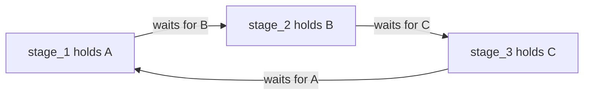
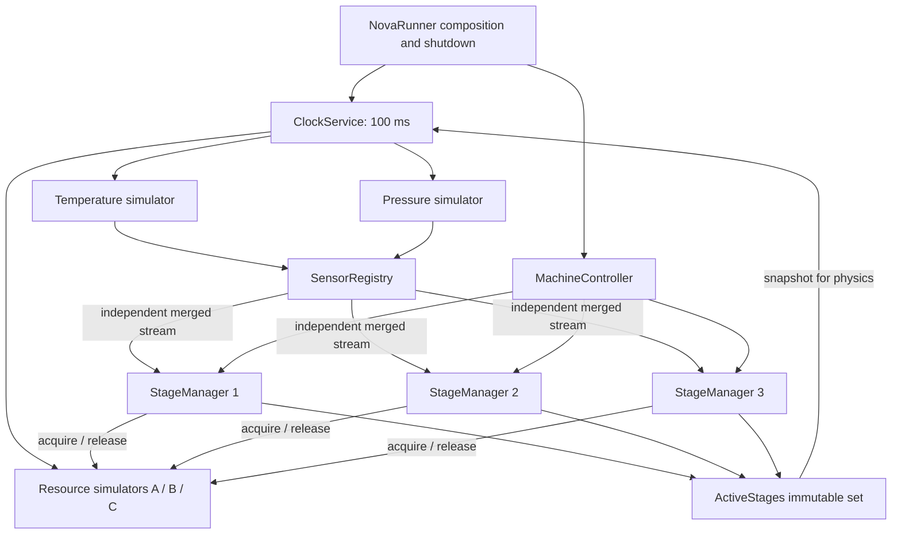

**Nova take-home exercise — code review and requirements sanity check**

Reviewed on 5 September 2026, against commit `436a9d5`. The working tree was clean when the review began. This report evaluates the implementation as it existed at that commit; the application and original tests have not been edited.

**Assessment:** The project has a useful, understandable foundation: separated sensor/resource interfaces, independent consumers, explicit stage rules, cancellation-aware resource acquisition, and substantial tests. The default lock ordering correctly prevents circular waits between the supplied stages. I would fix the sensor consistency and stage lifecycle defects, strengthen the concurrency demonstrations, and add the missing design/run documentation before submitting it.

The biggest issue is that a 250 ms timestamp window is described as an atomic sensor snapshot. It is only a bound on timestamp differences. It does not prevent combining readings from two different machine states. A second important issue is that completion and sensor handling can publish stage notifications out of order.

**Scope and evidence**

I read all application and test source files, project files, the solution, the seven local commits, [Nova's assignment](../SRE_Evaluation_Ver.2.0.md), and all 16 pages of the supplied [Common Concurrency Problems](../CommonConcurrencyProblems.pdf). The PDF is OSTEP chapter 32. Its sections 32.2 and 32.3 provide the atomicity/order-violation and deadlock vocabulary used below. Its homework commands were treated as document content, not as a request to execute that homework. The assignment's submission instructions were evaluated as requirements; no publication or submission was performed.

| Verification | Observed result |
| --- | --- |
| `dotnet build NovaExercise.slnx --no-restore -m:1 -p:UseSharedCompilation=false` | Succeeded; final incremental build reported zero warnings and errors. |
| `dotnet test NovaExercise.slnx --no-restore -m:1 --logger 'console;verbosity=normal'` | **109 passed**, zero failed. During compilation, xUnit1031 warnings appeared at `ConcurrencyExhibitTests.cs:107` and `SensorSimulatorTests.cs:195` for blocking waits. |
| Isolated [review probes](Probes/ReviewProbes.cs) | **12 passed**: they deliberately assert the problematic behavior, so passing means the issue was reproduced. They are outside `NovaExercise.slnx`. |
| Existing thread-ID test with `DOTNET_PROCESSOR_COUNT=1` | **Failed** at `MachineControllerTests.cs:107`: expected three distinct thread IDs, observed two. The preceding assertion that all stages were Running passed. |
| Console smoke run, approximately 12 seconds, followed by SIGINT | Exit code 0; 119 clock ticks; all stages and resources Idle at shutdown. No stage completion was logged in this run. |

Environment: Linux, .NET SDK 10.0.400, runtime 10.0.11. The initial sandbox blocked MSBuild IPC; tests were rerun with approved access. This was an environment restriction, not a project defect. Application build/testing used available dependencies; a completely empty-cache installation was not tested. There was no exhaustive schedule exploration, long-duration soak, or physical-device validation.

**Prioritized findings**

P1 means address before submission because it affects core correctness or an explicit deliverable. P2 means a meaningful defect or demonstration weakness with a narrower trigger. These priorities concern this exercise, not a production certification.

| ID | Priority | Finding | Evidence |
| --- | --- | --- | --- |
| F01 | P1 | Mixed sensor ticks can trigger a rule that is false in both complete frames. | Reproduced |
| F02 | P1 | Stale/missing sensor data does not stop an active run. | Reproduced; silence/age paths inspected |
| F03 | P1 | Sensor pump failure or completion is not delivered to the merged reader. | Both cases reproduced |
| F04 | P1 | A previous run's Idle notification can erase the next run's active status. | Forced interleaving reproduced |
| F05 | P2 | Work can start after an already-acquired resource has entered Error. | Reproduced |
| F06 | P2 | Duplicate resource entries cause self-deadlock even with `ByName`. | Reproduced through controller configuration |
| F07 | P2 | Older sequence numbers overwrite newer measurements. | Reproduced; relevant to replacement adapters |
| F08 | P2 | Completed runs retain linked cancellation sources. | Retained cancellation links reproduced |
| F09 | P2 | The concurrency tests depend on timing and thread allocation. | One portability failure reproduced; other weaknesses inspected |
| F10 | P2 | Default simulation dynamics undermine a successful-completion demo. | Smoke observation plus deterministic physics probes |
| F11 | P1 | Required design documentation, diagrams, and build/run instructions are missing. | Repository inventory/history |

**F01 — Timestamp proximity does not make a sensor frame atomic.**

Location: [StageManager](../Controller/IStageManager.cs), lines 104 and 156–183; [existing atomicity exhibit](../NovaTests/ConcurrencyExhibitTests.cs), lines 62–76. Probe: `F01_Mixed_ticks_start_work_even_when_both_complete_frames_fail_the_rule`.

Each arrival immediately updates `_latest` and evaluates the rule. The following input starts Rule 1 work once:

| Input/event | Temperature considered | Pressure considered | Rule 1 |
| --- | --- | --- | --- |
| Complete tick 1 | 5 | 40 | False |
| Temperature from tick 2 arrives | 25 | 40 from tick 1 | **True** |
| Complete tick 2 | 25 | 150 | False |

The ticks are 100 ms apart, inside the permitted 250 ms skew. Separate pump tasks can interleave these arrivals even though `ClockService` gives both measurements the same timestamp for each tick. Work can begin during the interval between arrivals, and a synchronous operation can finish before the new pressure arrives.

The existing test rejects a 500 ms gap. That demonstrates a skew filter, but does not substantiate its claim that the stage never acts on readings from different moments.

For the shared-clock simulator, publish an immutable frame containing the required values and a common frame/tick identifier, and evaluate once that frame is complete. For independent real sensors, explicitly define bounded-skew/latest-value semantics and the acceptable uncertainty; independent per-sensor sequence numbers alone are not common frame identifiers. A lock around the current dictionary would protect memory access but would not solve this input-consistency problem. Acceptance test: both complete frames above are false, so work must never start under a coherent-frame policy.

**F02 — Loss of a valid sensor view leaves work running.**

Location: [StageManager](../Controller/IStageManager.cs), lines 131–144 and 165–174. Probe: `F02_Stale_false_reading_does_not_abort_running_work`.

Start with Temperature 25 / Pressure 40. Stop pressure updates, then deliver Temperature 5 with a timestamp 900 ms newer. The stage stays Running and retains its resource because `TryGetConsistentValues` returns false and the abort condition only handles a valid view whose rule is false. The existing `Abort_check_ignores_an_inconsistent_pair_of_readings` test explicitly expects this behavior.

If every sensor stops, no further scan occurs at all. Also, timestamps are compared only with each other, not with a current clock: two equally old readings can pass the check. A queued acquisition can later start work after its triggering readings have expired. Default timed work eventually finishes, but custom long-running work can retain resources indefinitely until external cancellation.

Introduce a clear invalid-data state and an independent watchdog using an injectable clock. Check absolute age and required-sensor health before starting and while running/acquiring. A reasonable exercise policy is to cancel and inhibit work until a valid view returns. The assignment does not define a freshness timeout, so document the chosen policy rather than presenting 250 ms as a specified requirement. Test one silent sensor, all sensors silent, and expiration during acquisition.

**F03 — A failed producer can leave consumers waiting forever.**

Location: [SensorRegistry](../Sensor/SensorRegistry.cs), lines 48–62 and 67–79. Two `F03_...` probes cover completion and failure.

Pump tasks are started, but their results are observed only in the iterator's `finally`. The merged writer is never completed. A sensor can throw before its first measurement, leaving its pump faulted while the reader awaits a channel that will never produce that reading or report that exception. In the probe, the exception becomes observable only after external cancellation drives cleanup. A normally exhausted sensor stream also leaves the reader waiting.

This becomes especially relevant when replacing the infinite simulators with device/network adapters. Combined with F02, a failed sensor can leave an active stage using old knowledge without a health transition.

Supervise producers while the consumer is active. Propagate terminal faults promptly through the channel or a health/event protocol, and cancel/await sibling pumps when appropriate. If streams are required never to complete normally, treat completion as an explicit failure; otherwise complete the merged stream when all producers end. Tests should verify notification without needing external cancellation to expose the problem.

**F04 — Stage state and its notification are not ordered as one transition.**

Location: [StageManager](../Controller/IStageManager.cs), lines 236–244 and 106–128; [runner feedback callback](../NovaRunner/Program.cs), line 52. Probe: `F04_A_previous_runs_idle_notification_can_overwrite_the_new_runs_active_state`.

The reading loop and `ExecuteAsync` continuation both participate in lifecycle transitions. A legal schedule is:

1. Run 1 releases its resources and writes `_state = Idle`.
2. Execution pauses before its `stateChanged(Idle)` callback finishes.
3. A sensor reading sees Idle, starts Run 2, and publishes Running/active.
4. Run 1's delayed Idle callback removes that same stage from `ActiveStages`.

The result is a Running stage absent from the simulation's active set. The probe deliberately pauses the old callback to make the interleaving deterministic; a scheduler pause or slow logging can open the same window in the application. `volatile` makes a field visible, and `ImmutableInterlocked.Update` safely updates a set, but neither orders these two lifecycle notifications.

Serialize reading, completion, and state-notification events under one lifecycle owner, for example a per-stage event loop with a run identity. Alternatively enforce a carefully scoped transition protocol so a new run cannot start until the prior transition is fully published. Do not hold a monitor across resource awaits or arbitrary callbacks. Add a regression asserting that an old run cannot change the active status of a newer run. Separately, acknowledge that `MachineController.Snapshot()` is a collection of per-stage reads, not an atomic snapshot of the whole machine.

**F05 — Resource health is not revalidated before work begins.**

Location: [StageManager](../Controller/IStageManager.cs), lines 197–205. Probe: `F05_Work_begins_with_an_earlier_acquired_resource_in_error`.

A stage acquires A and waits for B. A fails. B becomes available before another sensor reading arrives. The stage enters Running and calls its work with A already in Error. `AcquireAsync` checks the newly acquired resource, but no final check covers the earlier holds. This needs no broken adapter: the probe uses the real `ResourceSimulator` for A and a controllable B.

Recheck cancellation, the accepted sensor view, and all held resource health immediately before the Running transition. For prompt failure response during work, introduce resource fault notifications or a health scan independent of sensor arrivals. A final check alone cannot guarantee a physical device will remain healthy after the check; document the detection/cancellation contract and its latency. Under an explicitly accepted sampled-health policy this is a limitation to explain, but the current documentation implies stronger abort behavior.

**F06 — Sorting does not protect against acquiring the same semaphore twice.**

Location: [MachineController](../Controller/MachineController.cs), lines 53–62; [StageManager acquisition loop](../Controller/IStageManager.cs), lines 197–200. Probe: `F06_Duplicate_resource_names_self_deadlock_even_with_ByName`.

Configure a stage with `["A", "A"]`. The constructor accepts it and sorting preserves both entries. The first acquisition succeeds; the second waits for the same stage's existing hold, which is released only after acquisition/work completes. External cancellation breaks the wait, but no cancellation is automatically scheduled. This is a genuine self-deadlock under accepted configuration, **not a defect in the provided three-stage map**.

Reject duplicate resource identities in a stage definition, or explicitly deduplicate if that is the intended input contract. Rejection makes mistakes more visible. The supplied PDF's lock-order example on page 8 explicitly assumes distinct locks, and page 16 calls attention to the same-object case.

**F07 — Sequence numbers do not currently prevent ordering violations.**

Location: [StageManager](../Controller/IStageManager.cs), lines 104 and 165; [SensorData contract](../Sensor/ISensor.cs), lines 9–14. Probe: `F07_Older_sequence_overwrites_a_newer_measurement_and_starts_work`.

After accepting tick 2 Temperature 5 / Pressure 40, deliver tick 1 Temperature 25. It overwrites the newer temperature and triggers Rule 1. Only sequence zero is rejected; duplicate or decreasing sequences are accepted.

The current simulator serializes publication per sensor, so it ordinarily preserves that sensor's order. This finding applies to an adapter delivering delayed/replayed data or a restart/replacement policy. Enforce monotonic sequences per sensor identity/session and define how a replacement starts a new epoch. Do not compare different sensors' sequence numbers as if they shared a clock. Add replay, duplicate, and reset tests. Validate source ID/type and non-finite readings at the adapter boundary as well.

**F08 — Per-run cancellation sources are never disposed.**

Location: [StageManager](../Controller/IStageManager.cs), lines 127–128 and 224–237. Probe: `F08_Completed_runs_remain_linked_to_the_parent_cancellation_source`.

Each trigger creates a linked source and overwrites `_runCts` on a later trigger. Neither completion nor shutdown disposes it. The parent shutdown token can therefore retain completed sources for the controller's entire lifetime. The probe registers observable callbacks on two completed runs and confirms that cancelling the parent still reaches both old tokens. The repeated abort/restart behavior increases the rate of accumulation.

Give each run explicit ownership of its source and dispose it once that run and cancellation interactions are finished. Coordinate this with the lifecycle fix so a concurrent scan cannot cancel a disposed source or clear a newer run's source. Microsoft documents disposal of linked sources as required cleanup: [cancellation guidance](https://learn.microsoft.com/en-us/dotnet/standard/threading/cancellation-in-managed-threads).

**F09 — Test passing currently depends partly on the scheduler.**

Locations: [MachineControllerTests](../NovaTests/MachineControllerTests.cs), lines 81–111; [ConcurrencyExhibitTests](../NovaTests/ConcurrencyExhibitTests.cs), lines 21–30 and 173–190.

`Stages_run_in_parallel_on_different_threads` asserts three distinct thread IDs. With one reported processor it failed: expected 3, actual 2, while all three stages were already Running. Concurrent asynchronous operations can share a pool thread; `Task.Run` does not reserve a dedicated thread for each stage. Test simultaneous progress with gates and independent resources, not distinct identities. See Microsoft's [ThreadPool documentation](https://learn.microsoft.com/en-us/dotnet/api/system.threading.threadpool?view=net-10.0).

The ring-deadlock exhibit relies on 5 ms acquisition delays and a 400 ms sleep. These encourage the desired schedule but do not establish that each stage owns its first resource before any requests its second. On a different schedule, the unsafe map may complete instead of deadlocking. The helper also duplicates the controller's ordering logic rather than exercising it. Use explicit acquisition gates/barriers, then assert the actual owner/wait relationships; cancel and await cleanup in `finally`, even if an assertion fails. Demonstrate prevention through `MachineController` as well as direct stage tests.

The atomicity exhibit checks excessive skew rather than a mixed-frame violation. The active-set stress loop may finish without meaningful overlap with its writer, although the separate immutable-snapshot and concurrent-update tests are useful. Blocking `Wait()` calls produce the two analyzer warnings noted above; use async tests and awaited cleanup. Passing stress tests alone do not prove an invariant.

**F10 — The default demo mostly illustrates aborts, not completed production.**

Locations: [runner defaults](../NovaRunner/Program.cs), lines 7–10; [temperature dynamics](../Simulator/TemperatureSensorSimulator.cs), lines 10–16; [pressure dynamics](../Simulator/PressureSensorSimulator.cs), lines 10–16. Probes: `F10_Default_physics_invalidates_each_stage_before_ten_seconds` (three cases).

With initial Temperature 20 / Pressure 30, no noise, and each stage considered independently, the implemented feedback makes its own rule false after:

| Stage | Ticks to rule false | Simulated time | Configured work duration |
| --- | --- | --- | --- |
| stage_1 | 60 | 6.0 s | 10 s |
| stage_2 | 22 | 2.2 s | 10 s |
| stage_3 | 9 | 0.9 s | 10 s |

These are deterministic calculations using the actual `ComputeNext` and stage predicates. The combined stochastic smoke run logged no completions, 21 starts of stage_2, one of stage_1, and repeated aborts. That short run does **not** prove permanent starvation or that every possible run fails to complete.

Continuous rule validity is a defensible assumption, but choose a demonstration scenario/duration that shows normal completion as well as invalidation, contention, and recovery. Keep deliberate boundary flapping as a separate scenario. Hysteresis or debounce would change business behavior, so explain such a choice rather than silently changing the assignment's thresholds.

**F11 — The submission lacks the conceptual-design deliverables.**

The tracked repository contains the assignment Markdown but no authored README, architecture/design document, or diagrams. Build and execution instructions are also absent. Comments describe parts of the implementation, but do not satisfy the explicit design discussion and submission requirements in assignment lines 45–73 and 101–145. The local history has seven incremental implementation commits; it does not establish a documented conceptual design before implementation.

Add a concise README with prerequisites, commands, flags, expected output, and deterministic demonstration scenarios. Add a design document describing component boundaries, communication, locking proof, sensor consistency, failure policy, and assumptions. Include an architecture diagram and a deadlock example. This review reconstructs the current design below, but should not be presented as evidence that a design artifact existed before implementation. The PDF is present locally but deliberately ignored by Git; the submitted explanation should be understandable without opening it.

**Deadlock analysis for the interview**

The supplied chapter explains the four necessary conditions: mutual exclusion, holding resources while waiting for more, no forced removal of ownership, and circular wait. The resource semaphore provides mutual exclusion. `StageManager` retains earlier acquisitions while awaiting later ones. Cooperative cancellation asks the holder to unwind; it does not forcibly take resources away. The chosen acquisition order is what removes circular wait.

| Stage | Assignment/listed order | Default `ByName` order |
| --- | --- | --- |
| stage_1 | A → B | A → B |
| stage_2 | C → B | B → C |
| stage_3 | A → C | A → C |

**The assignment map is already acyclic as listed.** Its acquisition constraints are A before B, C before B, and A before C. A valid total order is **A < C < B**. Thus `--as-listed` on the current runner is not a deadlock demonstration. Your existing test correctly recognizes this. Changing only acquisition speed cannot create a resource-order cycle in this map.

Default `ByName` enforces **A < B < C**, independently of how each stage lists its resources. In a resource-only wait cycle, each subsequent requested resource would have to be strictly greater than the resource already held, eventually returning to the starting resource. That is impossible under a strict total order. This proof assumes each resource is acquired at most once per run, resource names represent stable identities, and every participant follows the same protocol, including any acquisitions inside stage work or adapters.

The deliberate ring exhibit changes the ordering to A→B, B→C, C→A. After all first acquisitions, the dependency graph is:



This is a valid teaching example of a future/configuration change reintroducing circular wait. The final stage's listed order is reversed relative to the assignment, making the distinction explicit. Sorting the same definitions breaks the cycle.

The resource implementation has no obvious internal lock/semaphore inversion under its supported usage: `AcquireAsync` waits for the semaphore outside `_lock`; `TryAcquire` uses a zero-time wait; release and fault-state changes take only the short state lock. Sensor channel publication uses nonblocking writes, with synchronous continuations disabled by default, and immutable `ActiveStages` snapshots avoid concurrent mutation of a returned set. These are useful positive properties.

The remaining possibilities must be distinguished from circular wait:

| Situation | Classification / boundary |
| --- | --- |
| Duplicate resource in a stage | Self-deadlock, reproduced in F06. |
| A custom stage acquires extra resources in a different order | Can reintroduce circular wait; not present in default delay work. |
| Work awaits another stage that needs a resource it holds | Can create a task/resource dependency deadlock outside the name-order proof. |
| Work or an adapter ignores cancellation and never finishes | Unbounded wait and shutdown hang; not automatically a circular deadlock. No deadline currently bounds it. |
| Sensor pump has failed while its reader waits | Missing completion/failure notification, F03; a liveness failure. |
| Repeated rule changes cause start/abort cycles | Lack of useful progress; not evidence of resource deadlock. |
| One stage repeatedly loses access to a resource | Potential starvation. No scheduler-level fairness guarantee is implemented or proven. |

Global ordering provides deadlock prevention, not fairness, fault detection, or a completion deadline. Microsoft's semaphore documentation explicitly disclaims a guaranteed admission order and automatic owner identity checks: [Semaphore and SemaphoreSlim](https://learn.microsoft.com/en-us/dotnet/standard/threading/semaphore-and-semaphoreslim). Avoid presenting a semaphore as a fair, owner-checked lock.

An acquisition timeout can bound a wait, but is not a proof of deadlock prevention. If cancellation is ignored, timing out an await also does not make it safe to release resources still used by the underlying work. Cooperative work and shutdown behavior need an explicit contract.

**Requirements sanity check**

| Requirement | Assessment | Explanation |
| --- | --- | --- |
| Temperature and pressure updates every 100 ms | Implemented for the simulator | `PeriodicTimer`, 100 ms runner default, one timestamp per tick. This is scheduled sampling, with no hard real-time guarantee. |
| Exact stage resource map | Pass | All three mappings match the assignment. |
| Strict threshold comparisons | Pass | `>` / `<` are correct; boundary tests cover them. |
| Overlapping rules | Reasonable interpretation | Each stage uses the union of rules naming it. At T=25/P=70, rules 1 and 3 both hold, so **all three** stages are eligible. Document the union/no-priority assumption. |
| Multiple independent consumers | Implemented in one process | Each consumer gets its own sensor subscription and merged channel. Slow consumers drop samples without blocking others. This is not cross-OS-process IPC; document the interpretation of “processes.” |
| Resource Busy/Idle/Error states | Implemented | Mutual exclusion and fault state are separate, so an errored holder retains ownership until release. Health-response gap: F05. |
| Proper resource coordination | Mostly implemented | Shared instances, async semaphores, default global ordering, partial-hold cleanup. Duplicate validation and some exceptional paths need attention. |
| At least one deadlock and one non-deadlock example | Substantially present | Ring and lock ordering; readiness-before-use and immutable set updates. Repair the misleading mixed-sensor atomicity claim and make scheduling deterministic. |
| Sensor registration/management | Pass for startup registration | Duplicate IDs are rejected. Registration is documented as startup-only. |
| Sensor replacement | Partial / requires documented scope | A different adapter can be wired before startup. No live replace/unregister mechanism; same-ID registration throws. Live replacement is not explicitly required by the assignment. |
| Introducing sensors | Partial | Adapters share an interface, but new types require extending `SensorType`; every stage currently waits for every registered sensor. |
| Design and technology trade-offs | Missing deliverable | Need an authored explanation, not just source comments. |
| Architecture diagrams and run instructions | Missing deliverable | F11. |
| Automated tests | Present, with gaps | 109 pass in the normal environment; F09 and the added probes identify blind spots. |
| Commit history | Present | Seven focused implementation commits. Clear future fixes and documentation commits would strengthen explainability. |
| GitHub delivery and 24-hour deadline | Not verified | Local Git history is available; remote accessibility and the interview date were not checked. |

All pairs of supplied stages share a resource: stages 1/2 share B, 1/3 share A, and 2/3 share C. If each stage exclusively holds its full resource set throughout work, **at most one can actually perform work at a time**. Independent consumers can still evaluate and wait concurrently. This is a consequence of the assignment map under your exclusive-ownership model. Do not claim three simultaneous Running stages for this map. Disjoint-resource tests appropriately demonstrate the architecture's ability to support actual overlap.

The repeated-run and abort semantics also need documentation. The code retriggers on later readings while a predicate stays true; it does not enqueue a durable job for every threshold event. It cancels waiting/running work if a later valid reading makes its stage predicate false. The assignment does not explicitly select this policy over “trigger once and finish.” A queue, edge-triggering, or continuous eligibility can each be defensible if explained consistently.

**Architecture reconstructed from the implementation**



The core `Controller` depends on sensor/resource abstractions, while simulation physics remains outside it. Stage definitions are data plus injected rule/work functions. This is a good scale for a take-home exercise: adding a database, broker, distributed lock, or dependency injection framework is not necessary to solve the stated problem.

The principal maintainability issue is the implicit lifecycle protocol spread across the reading loop, executor continuation, mutable cancellation fields, callbacks, and host. Make that protocol explicit before adding more infrastructure. Consider moving the implementation out of `IStageManager.cs` into `StageManager.cs` for easier navigation once functional fixes are done.

**Other reliability and extensibility observations**

- **Required sensors should belong to a stage definition.** `SensorRegistry.Covers` currently requires every registered sensor. An unrelated or redundant sensor that never reports blocks every stage, and a stale redundant sensor can invalidate the whole view even when another sensor of that type is fresh. Multiple same-type readings use newest timestamp wins; equal-timestamp conflicts have no domain policy. Define stage dependencies and a simple sensor selection/failover rule.
- **Enforce startup-only registration.** The documented restriction is reasonable for this exercise, but the API permits registration after streams start. Existing pumps will not pick it up, while `Covers` begins requiring it; concurrent registration also mutates an ordinary dictionary being enumerated. Freeze registration when starting, or implement an explicit dynamic lifecycle. Do not advertise `Register` as replacing an existing ID.
- **Validate configuration before running.** Unknown resource names fail early, which is good. Duplicate stage names, missing required sensor types, and invalid resource parameters should also fail clearly. Missing sensor types currently produce a rule exception that kills that stage; the test suite records this behavior instead of validating configuration up front.
- **Treat cleanup failures separately.** The release loop at `IStageManager.cs:226` stops on the first exception. A future adapter with a failing `Release` could leave later resources held and skip the final state update. Attempt all releases and report failures. Normal balanced use of the current simulator does not throw here, so this is an adapter-hardening concern rather than a reproduced default-path bug.
- **Make ownership harder to misuse if the interface grows.** `Release` has no acquisition lease/owner token. Current stage code keeps a held list correctly, but an unrelated caller can release somebody else's hold. A lease disposed once per acquisition would reduce misuse without relying on thread identity across awaits.
- **Expose stage/clock failure to the host.** A crashing stage is logged and then remains stopped, potentially still appearing Idle. A clock exception can leave controller tasks waiting, and `Task.WhenAll` will not finish until those tasks finish. Choose an explicit policy: stop the machine, restart with limits, or report degraded health. The current logging policy is useful but not full supervision.
- **State delivery is lossy.** Per-sensor and merged channels use `DropOldest`. That suits a latest-state controller but can omit a short threshold excursion and allows consumers to act on different observed subsets. The merged queue can also let a much faster sensor evict a slower sensor's reading. Document this trade-off; add per-sensor latest slots or explicit frame handling if that is the intended contract.
- **Run entry points need a lifetime contract.** The intended usage is one `RunAsync` per controller/stage and one reading caller. A second concurrent `RunAsync` on the same instance breaks the single-owner assumption; reject it or document and enforce single use. The runner itself uses one instance correctly.

**Recommended work order and interview preparation**

1. Decide and document sensor-frame, freshness, and trigger/abort semantics. Fix F01–F03 and add tests that assert the corrected behavior.
2. Make stage lifecycle transitions ordered; address F04, F05, and cancellation-source ownership together. Test old-run/new-run interleavings explicitly.
3. Reject duplicate resource requirements and validate the startup configuration. Keep global ordering as the default.
4. Replace scheduler-dependent assertions with gated scenarios. Retain both a deliberate ring failure and its prevention, exercising the actual controller.
5. Add a repeatable demo showing at least one completed run, contention, a resource failure, recovery, and clean shutdown. Adjust demo work duration/dynamics consistently with the chosen policy.
6. Write the README and design document in your own words, including the diagrams, assumptions, and limits you can explain confidently.

Useful explanations to rehearse: why the exact map is acyclic even as listed; why a semaphore can deadlock asynchronously without blocking a thread; why immutable data and `volatile` do not make a multi-step protocol atomic; why a 250 ms skew bound is not a coherent frame; why concurrency does not imply distinct threads or simultaneous work; and what happens when a sensor stops or work ignores cancellation.

**Reproducing the review**

From the repository root:

```sh
dotnet restore NovaExercise.slnx
dotnet build NovaExercise.slnx --no-restore -m:1
dotnet test NovaExercise.slnx --no-restore -m:1
dotnet run --project NovaRunner/NovaRunner.csproj

# Review characterization probes; passing confirms existing problematic behavior.
dotnet test Review/Probes/ReviewProbes.csproj -m:1

# Portability reproduction; expected to expose the thread-ID assumption.
DOTNET_PROCESSOR_COUNT=1 dotnet test NovaTests/NovaTests.csproj --no-build --no-restore -m:1 --filter FullyQualifiedName~Stages_run_in_parallel_on_different_threads
```

Use Ctrl+C to stop the runner. Supported flags are `--debug` and `--as-listed`; the latter uses the original acyclic map, not the ring exhibit. The review probes are supporting evidence and intentionally have not been added to the main solution. After fixes, turn the relevant reproductions into regression tests asserting the desired behavior rather than preserving assertions of the defect.
